# 🔐 Network Scanning & Traffic Analysis Lab

## 📌 Overview
This project demonstrates network scanning and traffic analysis using Kali Linux, Metasploitable 2, Nmap, and Wireshark.

---

## 🛠 Tools Used
- Kali Linux
- Metasploitable 2
- Nmap
- Wireshark

---

## 🌐 Network Setup
- Kali Linux IP: 192.168.56.101
- Metasploitable IP: 192.168.56.102

---

## 🔍 Key Activities
- Host Discovery using Nmap
- Port Scanning
- Service Enumeration
- OS Detection
- Packet Analysis using Wireshark

---

## 📊 Findings
- Multiple open ports detected (FTP, SSH, HTTP, MySQL, etc.)
- ICMP traffic confirmed connectivity
- ARP packets showed MAC address resolution
- TCP SYN scans identified open and closed ports

---

## 📸 Screenshots

### Network Setup
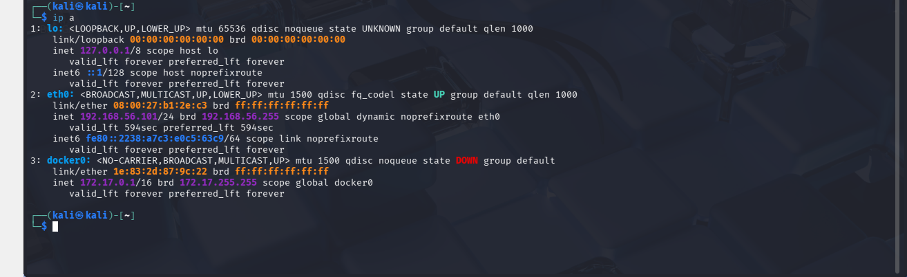
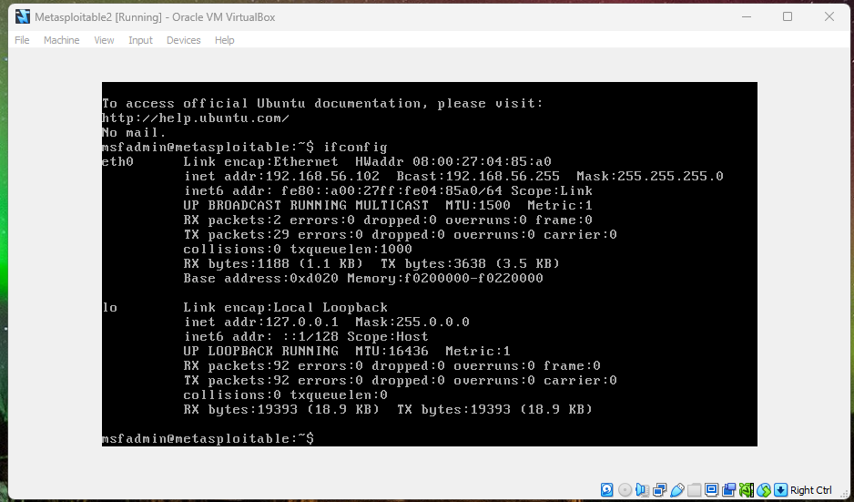

### Connectivity Test
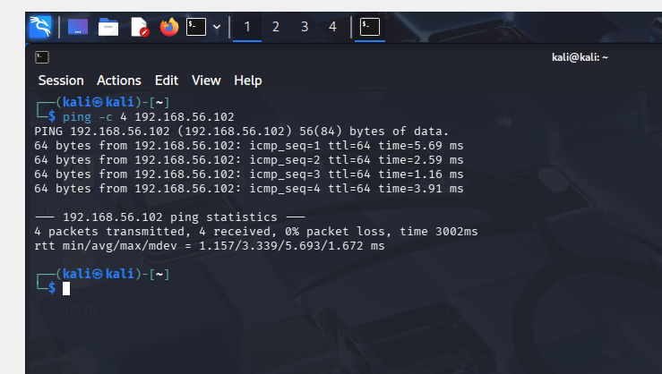

### Nmap Scanning
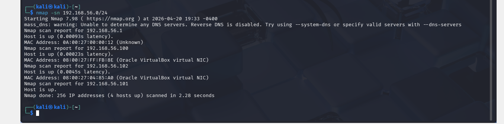
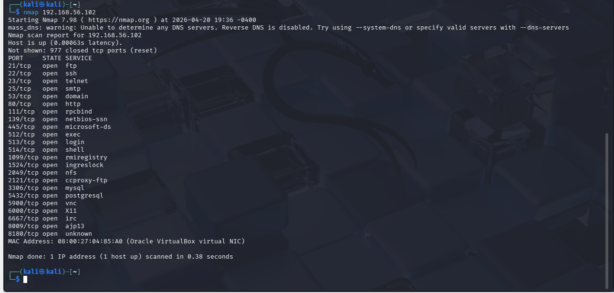
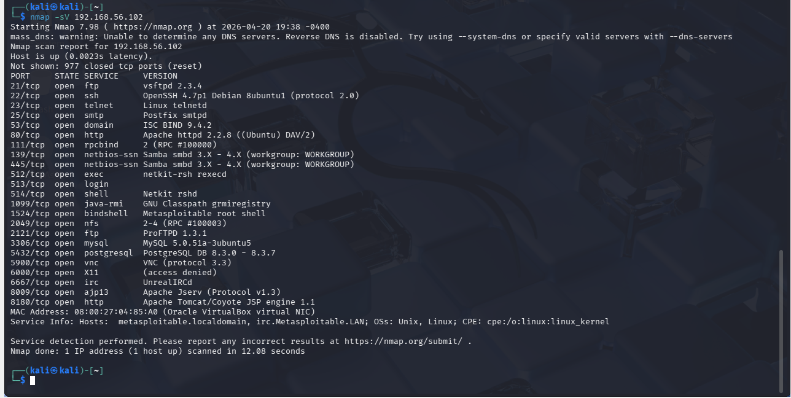
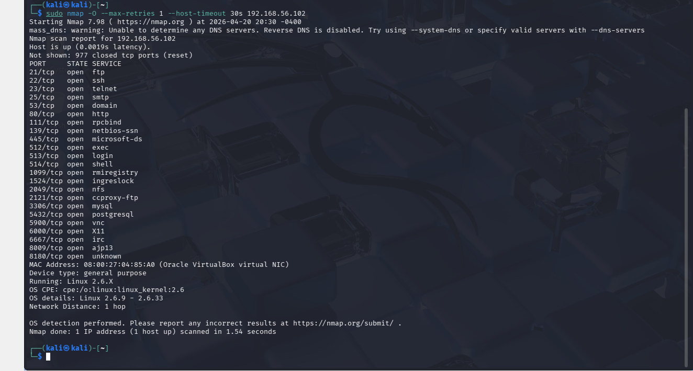

### Wireshark Analysis
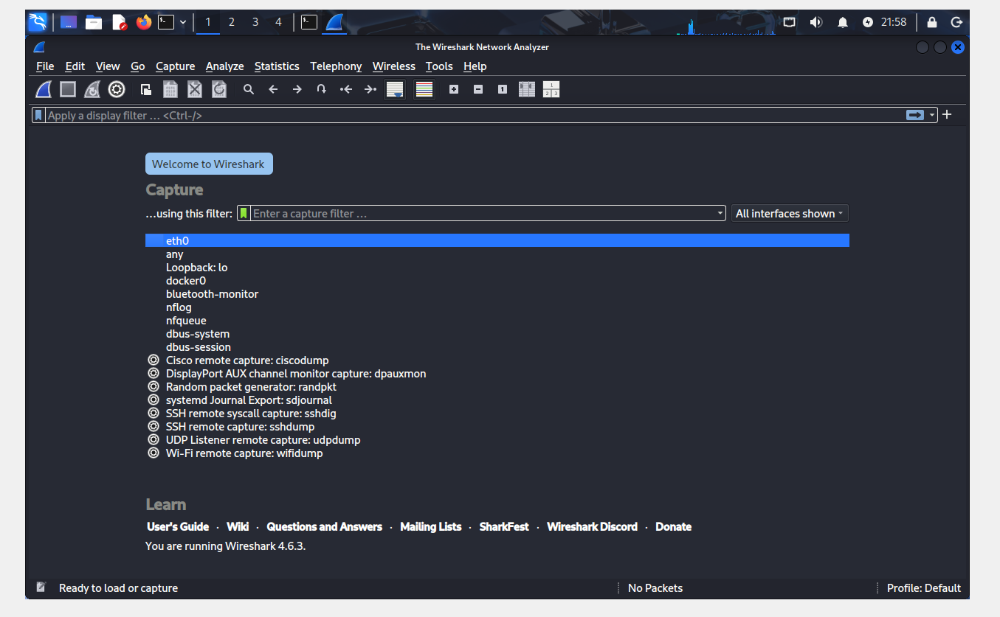
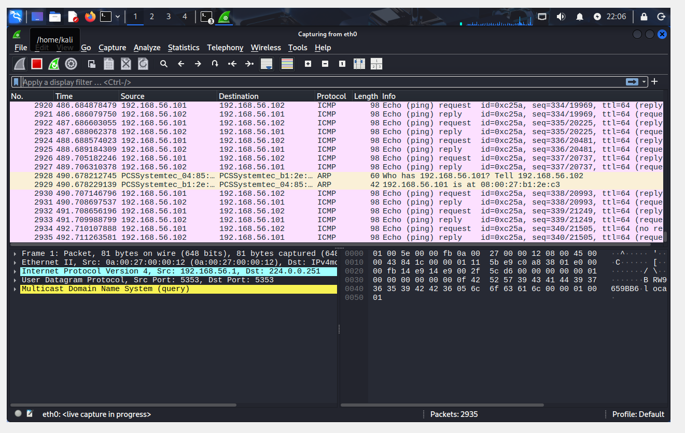
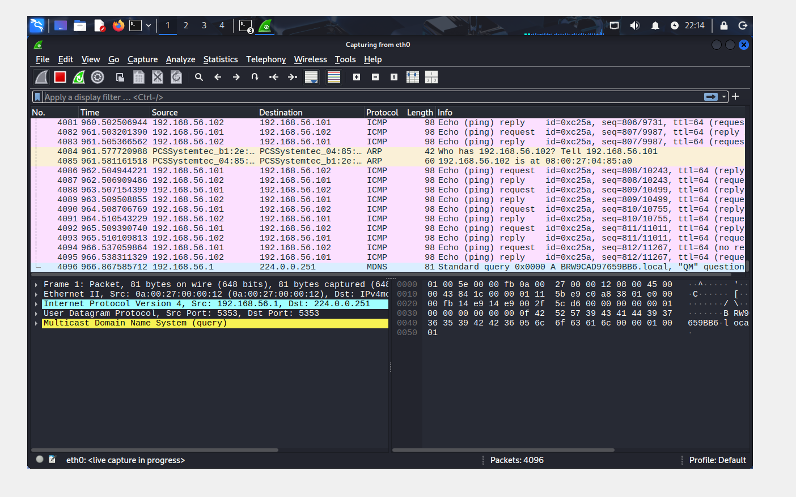
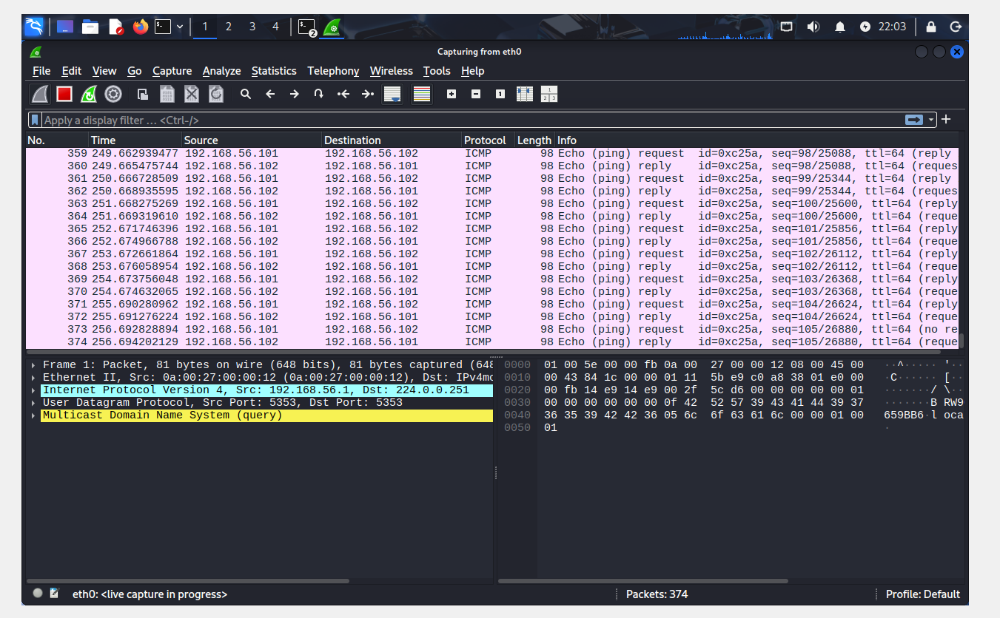
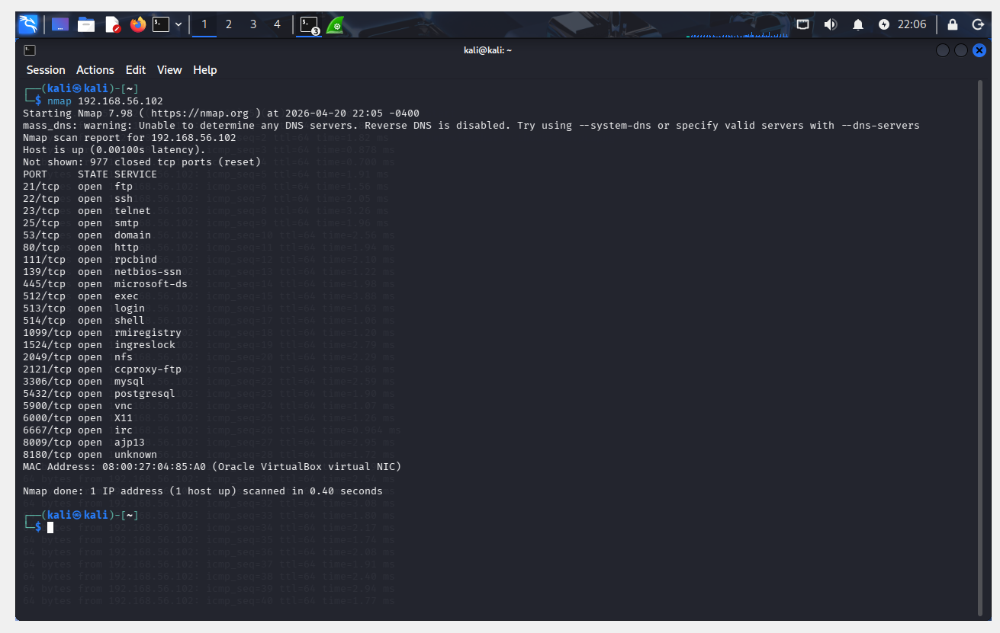
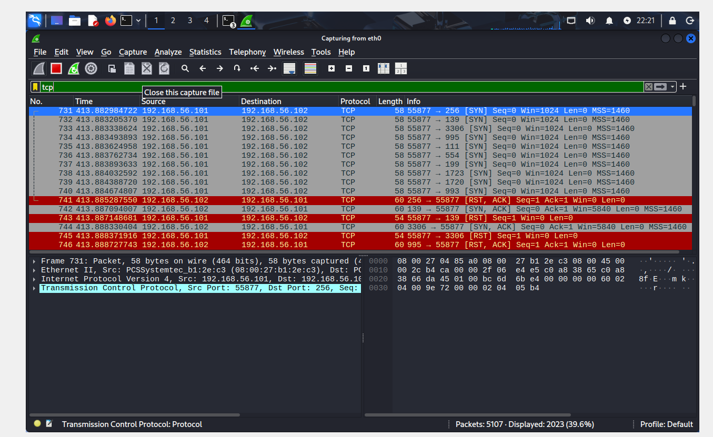
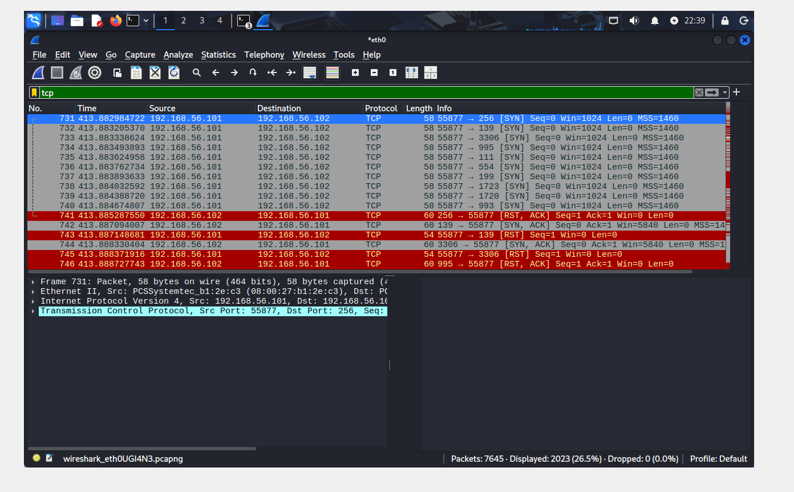

---

## 🧠 Conclusion
This project demonstrates how attackers perform reconnaissance and how defenders can detect such activity using network monitoring tools.

---

## 👨‍💻 Author
Rashed Rahman
